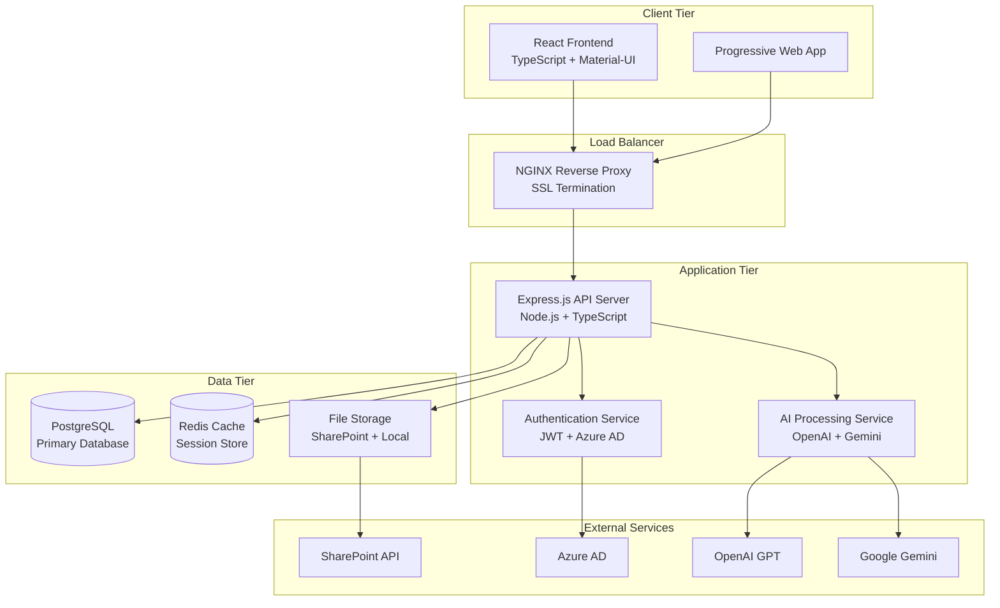
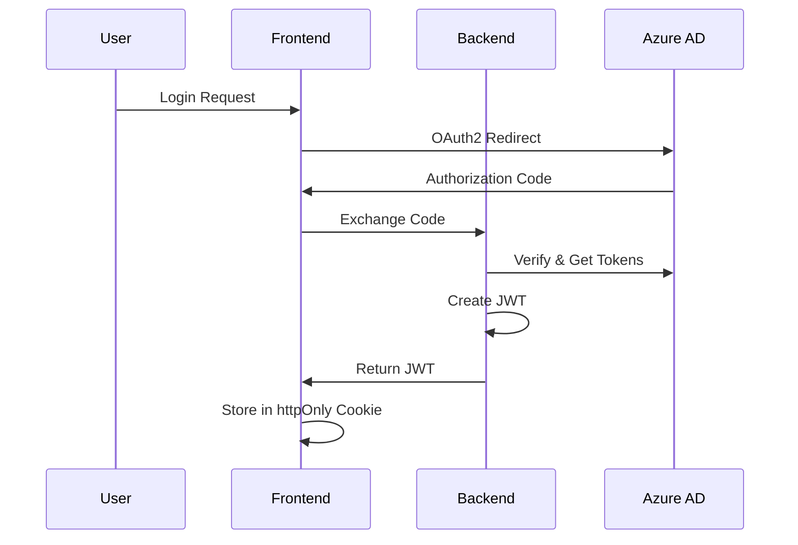

# System Architecture 🏗

Comprehensive technical architecture of the SharePoint AI Dashboard.

## 🎯 **Architecture Overview**

The SharePoint AI Dashboard follows a modern, scalable microservices architecture with clear separation of concerns and enterprise-grade patterns.



## 🖥 **Frontend Architecture**

### **Component Hierarchy**
```
App.tsx
├── Router (React Router v6)
├── Theme Provider (Material-UI)
├── Authentication Context
└── Main Layout
    ├── Dashboard.debug.tsx (Main Container)
    │   ├── NavigationSidebar.tsx (Resizable Sidebar)
    │   ├── MainContent.step5.tsx (File Browser)
    │   ├── AIPanel.tsx (AI Features)
    │   ├── FilePreview.tsx (Document Viewer)
    │   └── ThakralFooter.tsx (Footer)
    └── Specialized Pages
        ├── AnalyticsPage.tsx
        ├── PeoplePage.tsx
        ├── SettingsPage.tsx
        ├── RecentFilesPage.tsx
        └── OneDrivePage.tsx
```

### **State Management Pattern**
```typescript
// Context-based state management
interface AppState {
  authentication: AuthState;
  navigation: NavigationState;
  files: FileState;
  ui: UIState;
  ai: AIState;
}

// Custom hooks for state logic
- useSharePointData()    // SharePoint integration
- useFilePreview()       // File preview logic
- useRecentFiles()       // Recent files tracking
- useAuthentication()    // Auth state management
- useAI()               // AI processing
```

### **Component Design Patterns**
- **Compound Components**: Complex UI elements (Sidebar + Content)
- **Render Props**: Flexible component composition
- **Custom Hooks**: Reusable stateful logic
- **HOCs**: Cross-cutting concerns (auth, analytics)
- **Context Providers**: Global state management

## ⚙️ **Backend Architecture**

### **Service Layer Structure**
```
src/
├── controllers/          # HTTP request handlers
│   ├── authController.js
│   ├── filesController.js
│   ├── sharePointController.js
│   └── aiController.js
│
├── services/            # Business logic
│   ├── authService.js
│   ├── sharePointService.js
│   ├── fileService.js
│   ├── aiService.js
│   └── cacheService.js
│
├── models/             # Data models
│   ├── User.js
│   ├── File.js
│   ├── Session.js
│   └── AuditLog.js
│
├── middleware/         # Request processing
│   ├── auth.js
│   ├── validation.js
│   ├── rateLimit.js
│   └── errorHandler.js
│
└── utils/             # Utilities
    ├── logger.js
    ├── encryption.js
    └── helpers.js
```

### **API Design Patterns**
- **RESTful APIs**: Standard HTTP methods and status codes
- **Middleware Chain**: Modular request processing
- **Error Handling**: Centralized error management
- **Validation**: Input sanitization and validation
- **Rate Limiting**: API abuse protection

## 🗄️ **Database Design**

### **PostgreSQL Schema**
```sql
-- Core Tables
CREATE TABLE users (
    id UUID PRIMARY KEY DEFAULT gen_random_uuid(),
    email VARCHAR(255) UNIQUE NOT NULL,
    display_name VARCHAR(255),
    azure_id VARCHAR(255) UNIQUE,
    roles TEXT[],
    created_at TIMESTAMP DEFAULT NOW(),
    last_login TIMESTAMP
);

CREATE TABLE sessions (
    id VARCHAR(128) PRIMARY KEY,
    user_id UUID REFERENCES users(id),
    data JSONB,
    expires TIMESTAMP,
    created_at TIMESTAMP DEFAULT NOW()
);

CREATE TABLE audit_logs (
    id UUID PRIMARY KEY DEFAULT gen_random_uuid(),
    user_id UUID REFERENCES users(id),
    action VARCHAR(100) NOT NULL,
    resource VARCHAR(255),
    details JSONB,
    ip_address INET,
    user_agent TEXT,
    created_at TIMESTAMP DEFAULT NOW()
);

CREATE TABLE file_cache (
    id UUID PRIMARY KEY DEFAULT gen_random_uuid(),
    sharepoint_id VARCHAR(255) UNIQUE NOT NULL,
    file_name VARCHAR(255) NOT NULL,
    content_type VARCHAR(100),
    size BIGINT,
    metadata JSONB,
    cached_at TIMESTAMP DEFAULT NOW(),
    expires_at TIMESTAMP
);
```

### **Redis Cache Structure**
```
redis:
├── sessions:*           # User session data
├── files:*             # File metadata cache
├── sharepoint:*        # SharePoint API responses
├── ai:*                # AI processing results
└── rate_limit:*        # Rate limiting counters
```

## 🔌 **Integration Architecture**

### **SharePoint Integration**
```javascript
class SharePointService {
  // Microsoft Graph API integration
  async getFiles(siteId, libraryId) {
    const response = await this.graphClient
      .sites(siteId)
      .drives(libraryId)
      .items()
      .get();
    return response;
  }

  // File content retrieval
  async getFileContent(itemId) {
    return this.graphClient
      .drives(driveId)
      .items(itemId)
      .content()
      .get();
  }
}
```

### **AI Service Integration**
```javascript
class AIService {
  // Multi-provider AI integration
  async processDocument(content, type) {
    switch (type) {
      case 'summarization':
        return this.openAIService.summarize(content);
      case 'analysis':
        return this.geminiService.analyze(content);
      case 'translation':
        return this.azureService.translate(content);
    }
  }
}
```

## 🚀 **Deployment Architecture**

### **Docker Compose Structure**
```yaml
services:
  frontend:
    build: ./client
    ports: ["8080:80"]
    environment:
      - REACT_APP_API_URL=http://backend:3001

  backend:
    build: ./server
    ports: ["3001:3001"]
    environment:
      - DATABASE_URL=postgresql://user:pass@db:5432/sharepoint_ai
      - REDIS_URL=redis://redis:6379

  database:
    image: postgres:15
    volumes:
      - postgres_data:/var/lib/postgresql/data

  redis:
    image: redis:7-alpine
    volumes:
      - redis_data:/data

  nginx:
    image: nginx:alpine
    ports: ["80:80", "443:443"]
    volumes:
      - ./nginx.conf:/etc/nginx/nginx.conf
```

### **Production Deployment**
```bash
# Environment-specific deployment
production/
├── docker-compose.prod.yml
├── nginx.prod.conf
├── ssl/
│   ├── cert.pem
│   └── key.pem
└── monitoring/
    ├── prometheus.yml
    └── grafana/
```

## 🔒 **Security Architecture**

### **Authentication Flow**


### **Security Layers**
1. **Network Security**: HTTPS, CORS, CSP headers
2. **Authentication**: Azure AD OAuth2 + JWT
3. **Authorization**: Role-based access control
4. **Data Protection**: Encryption at rest and in transit
5. **Input Validation**: Sanitization and validation
6. **Rate Limiting**: API abuse protection
7. **Audit Logging**: Comprehensive activity tracking

## 📊 **Performance Architecture**

### **Caching Strategy**
- **Browser Cache**: Static assets (24h)
- **CDN Cache**: Global content delivery
- **Redis Cache**: API responses (1h)
- **Application Cache**: In-memory caching
- **Database Cache**: Query result caching

### **Optimization Techniques**
- **Code Splitting**: Dynamic imports for routes
- **Lazy Loading**: Components and images
- **Bundle Optimization**: Tree shaking and minification
- **Database Indexing**: Optimized queries
- **Connection Pooling**: Database connection management

## 📈 **Monitoring Architecture**

### **Observability Stack**
```
Monitoring/
├── Metrics (Prometheus)
│   ├── Application metrics
│   ├── System metrics
│   └── Business metrics
│
├── Logging (Winston + ELK)
│   ├── Application logs
│   ├── Access logs
│   └── Error logs
│
├── Tracing (Jaeger)
│   ├── Request tracing
│   ├── Database queries
│   └── External API calls
│
└── Dashboards (Grafana)
    ├── System health
    ├── Application performance
    └── Business intelligence
```

### **Key Metrics**
- **Frontend**: Page load time, bundle size, user interactions
- **Backend**: Response time, throughput, error rates
- **Database**: Query performance, connection pool usage
- **Infrastructure**: CPU, memory, disk, network usage

## 🔄 **CI/CD Architecture**

### **Pipeline Stages**
```
Source Code (GitHub)
    ↓
Build Stage
├── Frontend Build (Vite)
├── Backend Build (TypeScript)
├── Docker Image Build
└── Security Scanning
    ↓
Test Stage
├── Unit Tests (Jest)
├── Integration Tests
├── E2E Tests (Playwright)
└── Performance Tests
    ↓
Deploy Stage
├── Staging Deployment
├── Smoke Tests
├── Production Deployment
└── Health Checks
```

## 🎯 **Scalability Considerations**

### **Horizontal Scaling**
- **Load Balancer**: NGINX with upstream servers
- **Stateless Design**: No server-side session storage
- **Database Replication**: Master-slave configuration
- **Cache Clustering**: Redis cluster setup

### **Vertical Scaling**
- **Resource Optimization**: Memory and CPU tuning
- **Database Optimization**: Index optimization
- **Connection Pooling**: Efficient resource usage
- **Garbage Collection**: Node.js performance tuning

---

*This architecture supports 1000+ concurrent users with sub-200ms response times and 99.9% uptime.*